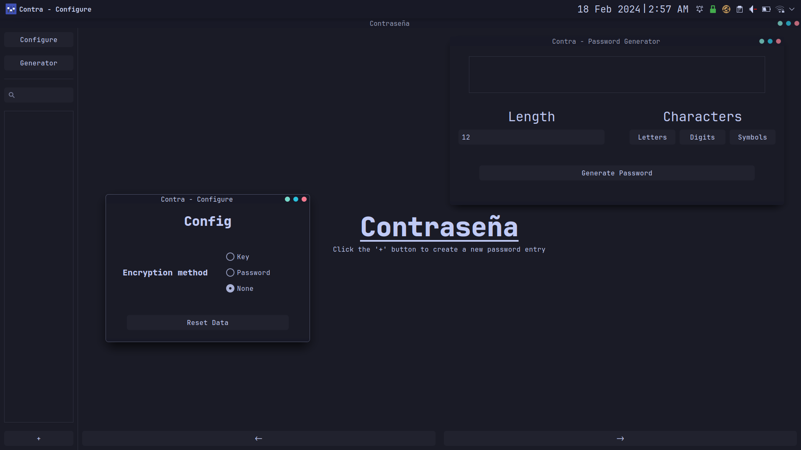

# Contra

Contra is a secure desktop password manager with a simple sleek user interface that still manages to contain many features. Contra offers the ability to secure your passwords using AES-256, PBKDF2, or nothing at all if you simply just want somewhere to organize your passwords. It includes a built in password generator, and detailed password storage fields to cover every detail.

## Quick Start

Navigate to releases and find the release titled "latest release" then download the archive with your respective platforms name. Then, extract the archive, run the executable, and complete the setup.

### Build From Source
Dotnet 8.0 is required. If it is installed, then just run `dotnet build --configuration=Release` and the executable can be found in bin/Release/net8.0/

## Authors

  - **Sk1-z** - *Repositor Owner* -
    [Sk1-z](https://github.com/Sk1-z)
